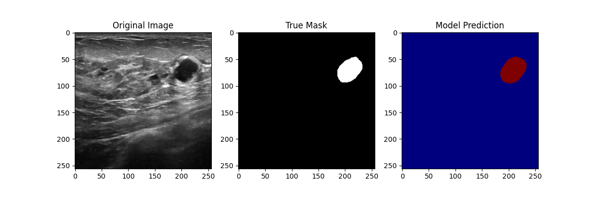

# Breast Cancer Segmentation using U-Net 🎗️

This project focuses on the automated detection and segmentation of breast cancer images using Deep Learning.

## 📊 Key Results
- **Architecture:** U-Net
- **Accuracy:** Achieved a **93.4% Dice Score**.
- **Interface:** Built a custom GUI for easy image testing.

## 🖼️ Visual Results

## 🛠️ Files in this Repository
- `breast cancer.py`: Core model training and logic.
- `gui_app.py`: The user interface for the application.
- `latest_result.png`: Sample output of the segmentation.
