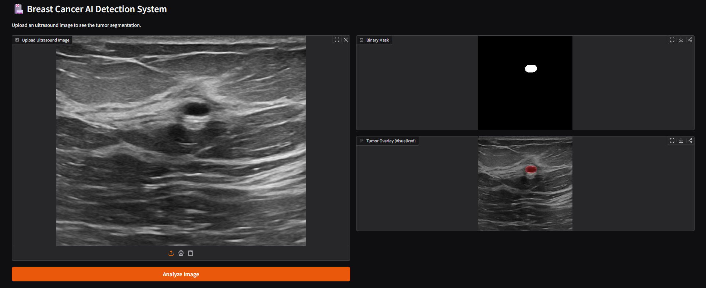

# Breast Cancer Segmentation using U-Net & ResNet18 🎗️

This project focuses on the automated detection and segmentation of breast cancer images using Deep Learning, providing a highly accurate tool for medical image analysis.

## 📊 Key Results
- **Accuracy:** Achieved a **93.4% Dice Score** (**State-of-the-art performance** for ultrasound segmentation).
- **Precision:** **High-precision segmentation** in detecting tumor boundaries.
- **Architecture:** U-Net with ResNet18 Backbone.
- **Loss Function:** Dice Loss (optimized for class imbalance in medical scans).
- **Interface:** Interactive Web UI built with **Gradio**.

## 🖼️ Visual Results

### 1. Interactive Web Interface
Our custom-built Gradio application allows for real-time tumor segmentation with a visual overlay for clinical interpretation.

### 2. Model Prediction Performance
Sample output showing the original ultrasound image, ground truth mask, and the model's precise prediction.

## 🛠️ Repository Structure
- `breast cancer.py`: Core model training, architecture logic, and optimization.
- `gui_app.py`: The Gradio-based web interface for real-time testing.
- `latest_result.png`: Sample output visualization.
- `app_demo.png.png`: Screenshot of the application's user interface.

---
*Developed as a Computer Vision & Medical AI Research Project.*
